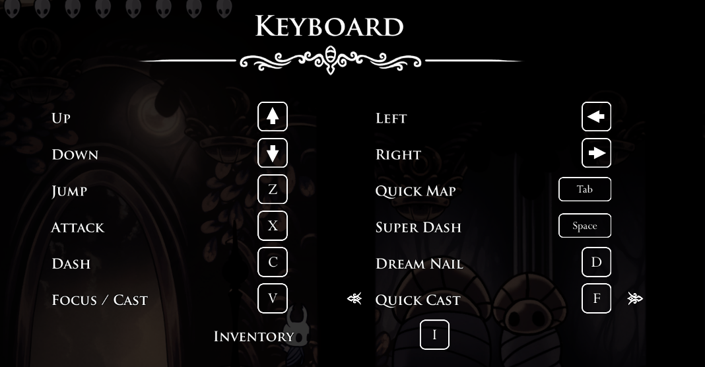

# Hollow Knight Real-time Status Monitoring Mod + Python Client
This project contains a Hollow Knight Mod and a Python client that together provide real-time monitoring of:

- Player (The Knight) current Health (HP) and Soul

- Current Boss health

- Player and Boss position (this is a global one), velocity

- Player and Boss bounding box size (width and height)

- The mod exposes these status data via a local HTTP server (http://localhost:8081/status/) for external access, such as by the Python client.

## Project Structure

```shell 
MyStatusMod/
├── MyStatusMod.csproj      # Mod project configuration
├── MyStatusMod.cs          # Mod source code
└── status_client.py        # Python client script
```

## Build the Mod and run the client 

1. Make sure your `.csproj` references the following DLLs from Hollow Knight’s Managed folder:

- `Assembly-CSharp.dll`

- `UnityEngine.dll`
  
- `UnityEngine.CoreModule.dll`

- `UnityEngine.Physics2DModule.dll` **(important! needed for `BoxCollider2D` support)**

2. Build the mod DLL:

```shell 
dotnet build 
```

3. Copy the generated `MyStatusMod.dll` to Hollow Knight’s Mods folder

4. Launch Hollow Knight and enter a game scene.

5. With the game running and mod loaded, run:

```
python status_client.py
```

### Sample Output 

```yaml
============================================================
[  19.92 s] Hollow Knight Game Status
FSM State: Unknown
Player HP: 9
Player Soul: 0
Boss HP: -1
Player Pos: (118.39, 14.41) Size: (0.50, 1.28) Vel: (8.30, 0.00)
Boss   Pos: (0.00, 0.00) Size: (0.00, 0.00) Vel: (0.00, 0.00)
Keys Pressed: ['right']
```

## Keyboard Binding 

